# XCM SDK Research

## 1. Context

Polkadot.js provides an XCM messages builder. This builder is a web application that allows users to build XCM messages and send them to a parachain. 
To build the XCM messages, the user needs to know the format of the messages. This format is described in the [Polkadot Wiki](https://wiki.polkadot.network/docs/learn-xcm).

The first step to create an XCM message is to select the xcmPallet and the function to use.

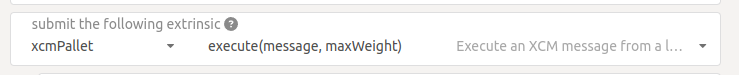

This comes from Polkadot API: 
```typescript
import { ApiContext } from '@polkadot/react-api';
const useApi = useContext(ApiContext)
const { api } = useApi();
api.tx['xcmPallet']
```

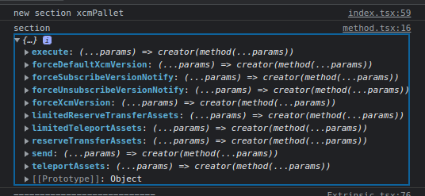

```json
{
    "send": {
        "name": "send",
        "fields": [
            {
                "name": "dest",
                "type": 123,
                "typeName": "Box<VersionedMultiLocation>",
                "docs": []
            },
            {
                "name": "message",
                "type": 370,
                "typeName": "Box<VersionedXcm<()>>",
                "docs": []
            }
        ],
        "index": 0,
        "docs": [],
        "args": [
            {
                "name": "dest",
                "type": "XcmVersionedMultiLocation",
                "typeName": "VersionedMultiLocation"
            },
            {
                "name": "message",
                "type": "XcmVersionedXcm",
                "typeName": "VersionedXcm"
            }
        ]
    },
    "teleportAssets": {
        "name": "teleport_assets",
        "fields": [
            {
                "name": "dest",
                "type": 123,
                "typeName": "Box<VersionedMultiLocation>",
                "docs": []
            },
            {
                "name": "beneficiary",
                "type": 123,
                "typeName": "Box<VersionedMultiLocation>",
                "docs": []
            },
            {
                "name": "assets",
                "type": 118,
                "typeName": "Box<VersionedMultiAssets>",
                "docs": []
            },
            {
                "name": "fee_asset_item",
                "type": 4,
                "typeName": "u32",
                "docs": []
            }
        ],
        "index": 1,
        "docs": [
            "Teleport some assets from the local chain to some destination chain.",
            "",
            "Fee payment on the destination side is made from the asset in the `assets` vector of",
            "index `fee_asset_item`. The weight limit for fees is not provided and thus is unlimited,",
            "with all fees taken as needed from the asset.",
            "",
            "- `origin`: Must be capable of withdrawing the `assets` and executing XCM.",
            "- `dest`: Destination context for the assets. Will typically be `X2(Parent, Parachain(..))` to send",
            "  from parachain to parachain, or `X1(Parachain(..))` to send from relay to parachain.",
            "- `beneficiary`: A beneficiary location for the assets in the context of `dest`. Will generally be",
            "  an `AccountId32` value.",
            "- `assets`: The assets to be withdrawn. The first item should be the currency used to to pay the fee on the",
            "  `dest` side. May not be empty.",
            "- `fee_asset_item`: The index into `assets` of the item which should be used to pay",
            "  fees."
        ],
        "args": [
            {
                "name": "dest",
                "type": "XcmVersionedMultiLocation",
                "typeName": "VersionedMultiLocation"
            },
            {
                "name": "beneficiary",
                "type": "XcmVersionedMultiLocation",
                "typeName": "VersionedMultiLocation"
            },
            {
                "name": "assets",
                "type": "XcmVersionedMultiAssets",
                "typeName": "VersionedMultiAssets"
            },
            {
                "name": "feeAssetItem",
                "type": "u32",
                "typeName": "u32"
            }
        ]
    },
    "reserveTransferAssets": {
        "name": "reserve_transfer_assets",
        "fields": [
            {
                "name": "dest",
                "type": 123,
                "typeName": "Box<VersionedMultiLocation>",
                "docs": []
            },
            {
                "name": "beneficiary",
                "type": 123,
                "typeName": "Box<VersionedMultiLocation>",
                "docs": []
            },
            {
                "name": "assets",
                "type": 118,
                "typeName": "Box<VersionedMultiAssets>",
                "docs": []
            },
            {
                "name": "fee_asset_item",
                "type": 4,
                "typeName": "u32",
                "docs": []
            }
        ],
        "index": 2,
        "docs": [
            "Transfer some assets from the local chain to the sovereign account of a destination",
            "chain and forward a notification XCM.",
            "",
            "Fee payment on the destination side is made from the asset in the `assets` vector of",
            "index `fee_asset_item`. The weight limit for fees is not provided and thus is unlimited,",
            "with all fees taken as needed from the asset.",
            "",
            "- `origin`: Must be capable of withdrawing the `assets` and executing XCM.",
            "- `dest`: Destination context for the assets. Will typically be `X2(Parent, Parachain(..))` to send",
            "  from parachain to parachain, or `X1(Parachain(..))` to send from relay to parachain.",
            "- `beneficiary`: A beneficiary location for the assets in the context of `dest`. Will generally be",
            "  an `AccountId32` value.",
            "- `assets`: The assets to be withdrawn. This should include the assets used to pay the fee on the",
            "  `dest` side.",
            "- `fee_asset_item`: The index into `assets` of the item which should be used to pay",
            "  fees."
        ],
        "args": [
            {
                "name": "dest",
                "type": "XcmVersionedMultiLocation",
                "typeName": "VersionedMultiLocation"
            },
            {
                "name": "beneficiary",
                "type": "XcmVersionedMultiLocation",
                "typeName": "VersionedMultiLocation"
            },
            {
                "name": "assets",
                "type": "XcmVersionedMultiAssets",
                "typeName": "VersionedMultiAssets"
            },
            {
                "name": "feeAssetItem",
                "type": "u32",
                "typeName": "u32"
            }
        ]
    },
    "execute": {
        "name": "execute",
        "fields": [
            {
                "name": "message",
                "type": 405,
                "typeName": "Box<VersionedXcm<<T as SysConfig>::Call>>",
                "docs": []
            },
            {
                "name": "max_weight",
                "type": 8,
                "typeName": "Weight",
                "docs": []
            }
        ],
        "index": 3,
        "docs": [
            "Execute an XCM message from a local, signed, origin.",
            "",
            "An event is deposited indicating whether `msg` could be executed completely or only",
            "partially.",
            "",
            "No more than `max_weight` will be used in its attempted execution. If this is less than the",
            "maximum amount of weight that the message could take to be executed, then no execution",
            "attempt will be made.",
            "",
            "NOTE: A successful return to this does *not* imply that the `msg` was executed successfully",
            "to completion; only that *some* of it was executed."
        ],
        "args": [
            {
                "name": "message",
                "type": "XcmVersionedXcm",
                "typeName": "VersionedXcm"
            },
            {
                "name": "maxWeight",
                "type": "u64",
                "typeName": "Weight"
            }
        ]
    },
    "forceXcmVersion": {
        "name": "force_xcm_version",
        "fields": [
            {
                "name": "location",
                "type": 87,
                "typeName": "Box<MultiLocation>",
                "docs": []
            },
            {
                "name": "xcm_version",
                "type": 4,
                "typeName": "XcmVersion",
                "docs": []
            }
        ],
        "index": 4,
        "docs": [
            "Extoll that a particular destination can be communicated with through a particular",
            "version of XCM.",
            "",
            "- `origin`: Must be Root.",
            "- `location`: The destination that is being described.",
            "- `xcm_version`: The latest version of XCM that `location` supports."
        ],
        "args": [
            {
                "name": "location",
                "type": "XcmV1MultiLocation",
                "typeName": "MultiLocation"
            },
            {
                "name": "xcmVersion",
                "type": "u32",
                "typeName": "XcmVersion"
            }
        ]
    },
    "forceDefaultXcmVersion": {
        "name": "force_default_xcm_version",
        "fields": [
            {
                "name": "maybe_xcm_version",
                "type": 214,
                "typeName": "Option<XcmVersion>",
                "docs": []
            }
        ],
        "index": 5,
        "docs": [
            "Set a safe XCM version (the version that XCM should be encoded with if the most recent",
            "version a destination can accept is unknown).",
            "",
            "- `origin`: Must be Root.",
            "- `maybe_xcm_version`: The default XCM encoding version, or `None` to disable."
        ],
        "args": [
            {
                "name": "maybeXcmVersion",
                "type": "Option<u32>",
                "typeName": "Option<XcmVersion>"
            }
        ]
    },
    "forceSubscribeVersionNotify": {
        "name": "force_subscribe_version_notify",
        "fields": [
            {
                "name": "location",
                "type": 123,
                "typeName": "Box<VersionedMultiLocation>",
                "docs": []
            }
        ],
        "index": 6,
        "docs": [
            "Ask a location to notify us regarding their XCM version and any changes to it.",
            "",
            "- `origin`: Must be Root.",
            "- `location`: The location to which we should subscribe for XCM version notifications."
        ],
        "args": [
            {
                "name": "location",
                "type": "XcmVersionedMultiLocation",
                "typeName": "VersionedMultiLocation"
            }
        ]
    },
    "forceUnsubscribeVersionNotify": {
        "name": "force_unsubscribe_version_notify",
        "fields": [
            {
                "name": "location",
                "type": 123,
                "typeName": "Box<VersionedMultiLocation>",
                "docs": []
            }
        ],
        "index": 7,
        "docs": [
            "Require that a particular destination should no longer notify us regarding any XCM",
            "version changes.",
            "",
            "- `origin`: Must be Root.",
            "- `location`: The location to which we are currently subscribed for XCM version",
            "  notifications which we no longer desire."
        ],
        "args": [
            {
                "name": "location",
                "type": "XcmVersionedMultiLocation",
                "typeName": "VersionedMultiLocation"
            }
        ]
    },
    "limitedReserveTransferAssets": {
        "name": "limited_reserve_transfer_assets",
        "fields": [
            {
                "name": "dest",
                "type": 123,
                "typeName": "Box<VersionedMultiLocation>",
                "docs": []
            },
            {
                "name": "beneficiary",
                "type": 123,
                "typeName": "Box<VersionedMultiLocation>",
                "docs": []
            },
            {
                "name": "assets",
                "type": 118,
                "typeName": "Box<VersionedMultiAssets>",
                "docs": []
            },
            {
                "name": "fee_asset_item",
                "type": 4,
                "typeName": "u32",
                "docs": []
            },
            {
                "name": "weight_limit",
                "type": 116,
                "typeName": "WeightLimit",
                "docs": []
            }
        ],
        "index": 8,
        "docs": [
            "Transfer some assets from the local chain to the sovereign account of a destination",
            "chain and forward a notification XCM.",
            "",
            "Fee payment on the destination side is made from the asset in the `assets` vector of",
            "index `fee_asset_item`, up to enough to pay for `weight_limit` of weight. If more weight",
            "is needed than `weight_limit`, then the operation will fail and the assets send may be",
            "at risk.",
            "",
            "- `origin`: Must be capable of withdrawing the `assets` and executing XCM.",
            "- `dest`: Destination context for the assets. Will typically be `X2(Parent, Parachain(..))` to send",
            "  from parachain to parachain, or `X1(Parachain(..))` to send from relay to parachain.",
            "- `beneficiary`: A beneficiary location for the assets in the context of `dest`. Will generally be",
            "  an `AccountId32` value.",
            "- `assets`: The assets to be withdrawn. This should include the assets used to pay the fee on the",
            "  `dest` side.",
            "- `fee_asset_item`: The index into `assets` of the item which should be used to pay",
            "  fees.",
            "- `weight_limit`: The remote-side weight limit, if any, for the XCM fee purchase."
        ],
        "args": [
            {
                "name": "dest",
                "type": "XcmVersionedMultiLocation",
                "typeName": "VersionedMultiLocation"
            },
            {
                "name": "beneficiary",
                "type": "XcmVersionedMultiLocation",
                "typeName": "VersionedMultiLocation"
            },
            {
                "name": "assets",
                "type": "XcmVersionedMultiAssets",
                "typeName": "VersionedMultiAssets"
            },
            {
                "name": "feeAssetItem",
                "type": "u32",
                "typeName": "u32"
            },
            {
                "name": "weightLimit",
                "type": "XcmV2WeightLimit",
                "typeName": "WeightLimit"
            }
        ]
    },
    "limitedTeleportAssets": {
        "name": "limited_teleport_assets",
        "fields": [
            {
                "name": "dest",
                "type": 123,
                "typeName": "Box<VersionedMultiLocation>",
                "docs": []
            },
            {
                "name": "beneficiary",
                "type": 123,
                "typeName": "Box<VersionedMultiLocation>",
                "docs": []
            },
            {
                "name": "assets",
                "type": 118,
                "typeName": "Box<VersionedMultiAssets>",
                "docs": []
            },
            {
                "name": "fee_asset_item",
                "type": 4,
                "typeName": "u32",
                "docs": []
            },
            {
                "name": "weight_limit",
                "type": 116,
                "typeName": "WeightLimit",
                "docs": []
            }
        ],
        "index": 9,
        "docs": [
            "Teleport some assets from the local chain to some destination chain.",
            "",
            "Fee payment on the destination side is made from the asset in the `assets` vector of",
            "index `fee_asset_item`, up to enough to pay for `weight_limit` of weight. If more weight",
            "is needed than `weight_limit`, then the operation will fail and the assets send may be",
            "at risk.",
            "",
            "- `origin`: Must be capable of withdrawing the `assets` and executing XCM.",
            "- `dest`: Destination context for the assets. Will typically be `X2(Parent, Parachain(..))` to send",
            "  from parachain to parachain, or `X1(Parachain(..))` to send from relay to parachain.",
            "- `beneficiary`: A beneficiary location for the assets in the context of `dest`. Will generally be",
            "  an `AccountId32` value.",
            "- `assets`: The assets to be withdrawn. The first item should be the currency used to to pay the fee on the",
            "  `dest` side. May not be empty.",
            "- `fee_asset_item`: The index into `assets` of the item which should be used to pay",
            "  fees.",
            "- `weight_limit`: The remote-side weight limit, if any, for the XCM fee purchase."
        ],
        "args": [
            {
                "name": "dest",
                "type": "XcmVersionedMultiLocation",
                "typeName": "VersionedMultiLocation"
            },
            {
                "name": "beneficiary",
                "type": "XcmVersionedMultiLocation",
                "typeName": "VersionedMultiLocation"
            },
            {
                "name": "assets",
                "type": "XcmVersionedMultiAssets",
                "typeName": "VersionedMultiAssets"
            },
            {
                "name": "feeAssetItem",
                "type": "u32",
                "typeName": "u32"
            },
            {
                "name": "weightLimit",
                "type": "XcmV2WeightLimit",
                "typeName": "WeightLimit"
            }
        ]
    }
}
```

For example, by selecting xcmPallet > send(destination, message). An extrinsic object is generated:

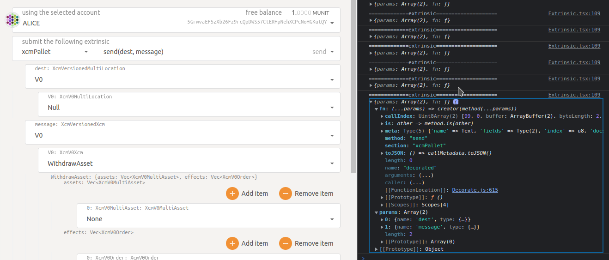

## 2. Params

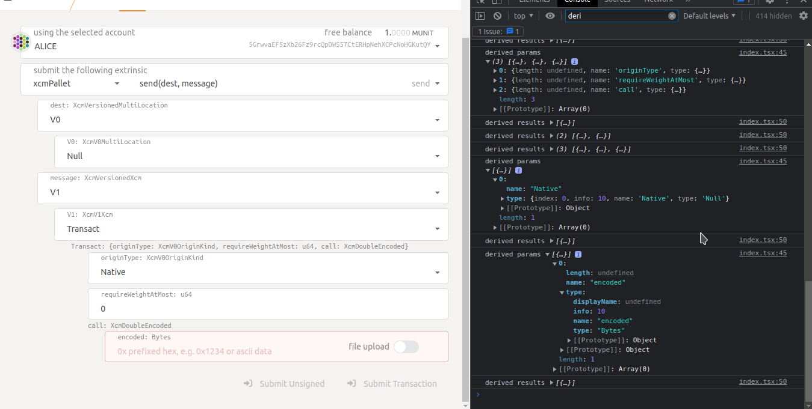

Transaction Parameters

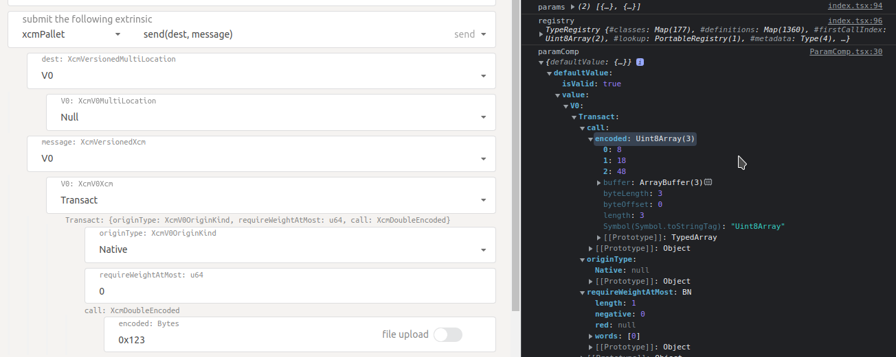

Parachain Id

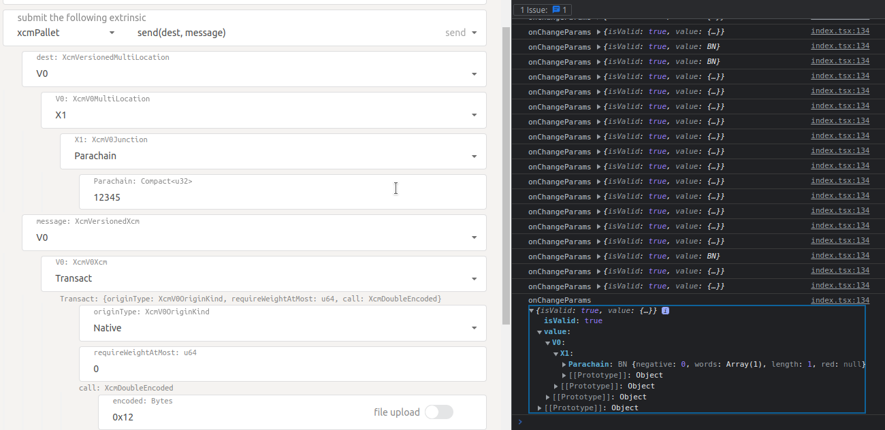

There are “special components” for each data type, they are displayed dynamically based on the parameters

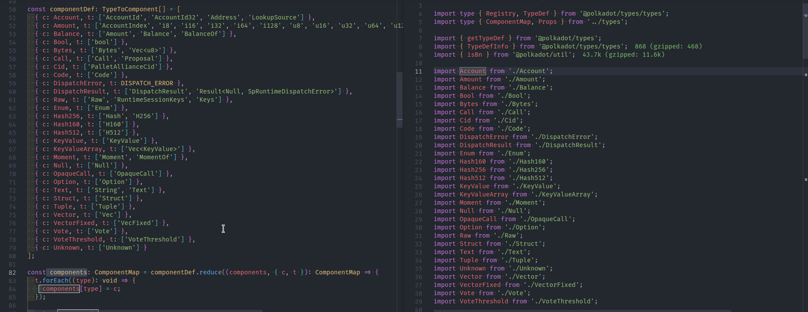

Types

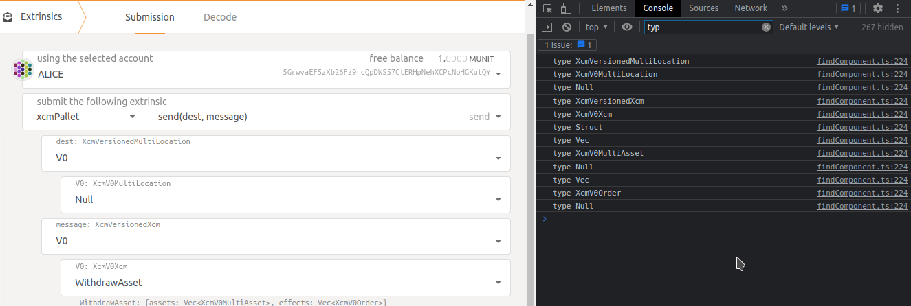

## 3. Extrinsic

When an extrinsic is selected/value changed, it goes through an fn() function of the xcm message, the selected values are passed to this function and this generates the SubmittableExtrinsic

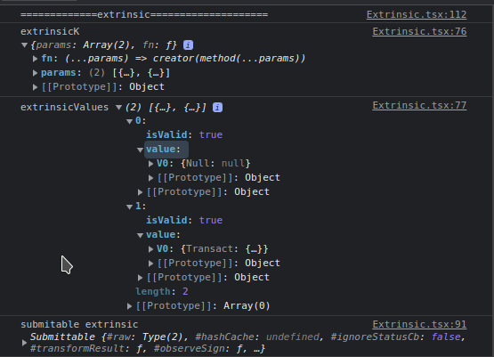


## 4. Sending Transaction

Data sending to a local parachain

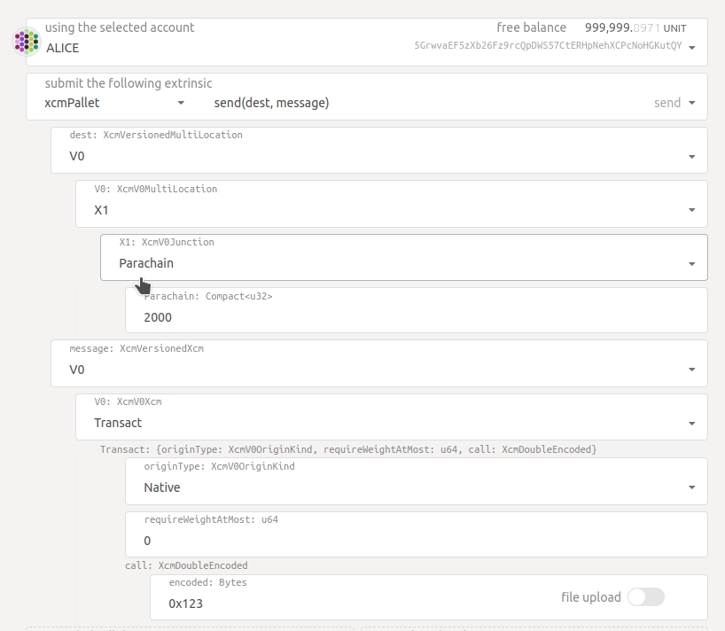

logs before and after sending transaction:

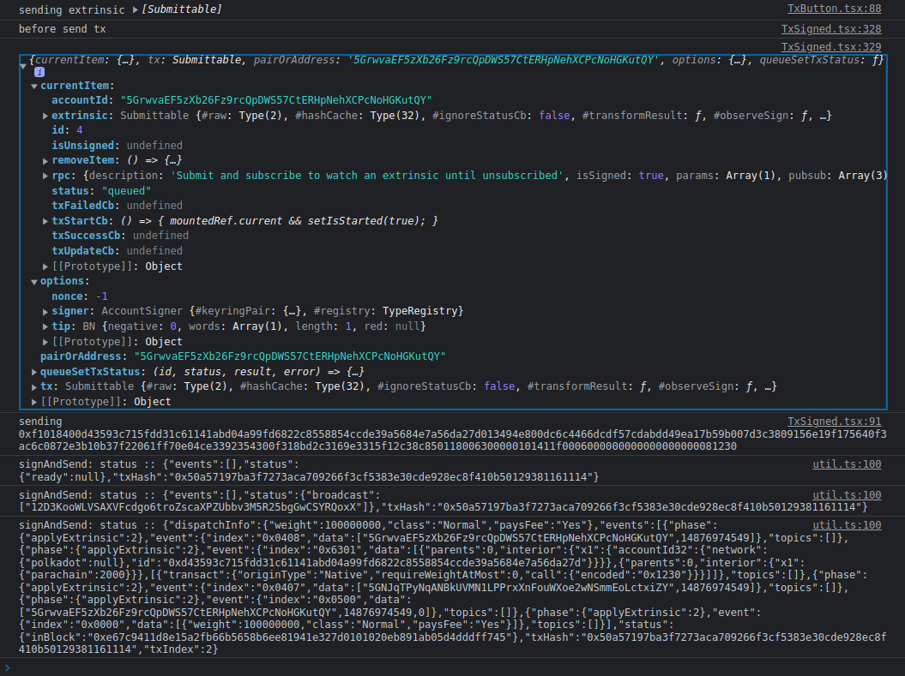

explorer log:

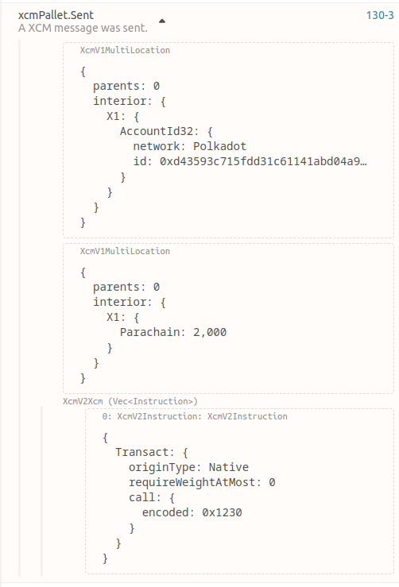

## License

Apache license version 2.0