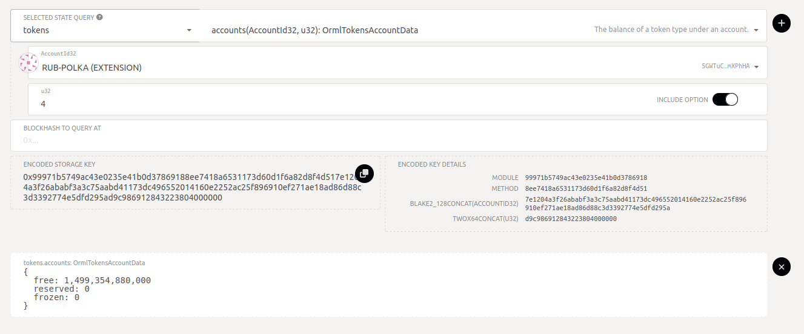
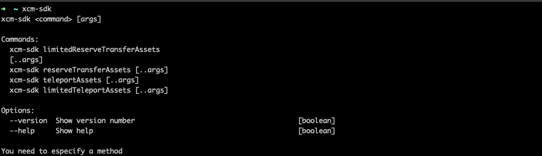

XCM SDK
=======

[](https://circleci.com/gh/blockcoders/xcm-sdk/tree/main)
[](https://coveralls.io/github/blockcoders/xcm-sdk?branch=main)
[](https://github.com/blockcoders/xcm-sdk/actions/workflows/codeql-analysis.yml)
[](https://www.npmjs.com/package/xcm-sdk)
[](https://www.npmjs.com/package/xcm-sdk?activeTab=versions)
[](https://snyk.io/test/github/blockcoders/xcm-sdk)
[](https://opensource.org/licenses/MIT)

## About

XCM SDK is a tool that provides an interface to send XCM messages for Substrate based blockchains. This library is written in Typescript so it can be imported in a whole new set of applications or dApps that use Javascript/Typescript engines such as Node.js.

## Get Started

### Install

```sh
npm i xcm-sdk
```

### Usage

```ts
// JavaScript
const { Provider } = require("xcm-sdk")

// TypeScript
import { Provider } from "xcm-sdk"
```

### Provider

```ts
const provider = new Provider(rpc, sender)
```

<table>
  <tr>
    <th>Param</th>
    <th>Description</th>
  </tr>
  <tr>
    <td>rpc</td>
    <td>rpc endpoint</td>
  </tr>
    <tr>
    <td>sender</td>
    <td>signer of the transaction</td>
  </tr>
</table>


### Examples
If you want to sign with Alice in a local node:

```ts
import { Keyring } from '@polkadot/keyring'
import { cryptoWaitReady } from '@polkadot/util-crypto'

const rpc = "ws://127.0.0.1:37345" // local node ws
await cryptoWaitReady();

const keyring = new Keyring({ type: "sr25519" });
const sender = keyring.addFromUri("//Alice");

const provider = new Provider(rpc, sender);

```

If you want to sign with mnemonic

```ts
import { Keyring } from '@polkadot/keyring'

const sender = keyring.addFromMnemonic(
"<your mnemonic seed here>"
);
```

If you want to sign with polkadotjs extension
```ts
import { web3FromAddress, web3Accounts, web3Enable } from "@polkadot/extension-dapp";

const extensions = await web3Enable("<your app name>");
const accounts = await web3Accounts();
const accountId = accounts[0].address;

const injector = await web3FromAddress(accountId);

const provider = new Provider(rpc, accountId);
provider.setInjectorSigner(injector.signer);
```

## Supported Methods

<a href="https://wiki.polkadot.network/docs/learn-xcm#reserve-asset-transfer"> Reserve Asset Transfer </a> with reserveTransferAsset and LimitedReserveTransferAsset methods and <a href="https://wiki.polkadot.network/docs/learn-xcm#asset-teleportation">Asset teleportation </a> with teleportAsset and LimitedTeleportAsset methods.

```ts
provider.limitedReserveTransferAssets(params)

provider.reserveTransferAssets(params)

provider.limitedReserveTransferAssets(params)

provider.reserveTransferAssets(params)
```

### Methods parameters

<table>
  <tr>
    <th>Param</th>
    <th>Description</th>
  </tr>
  <tr>
    <td>destination</td>
    <td>The destination to transfer the asset. If you want to transfer asset from relaychain to a parachain set 'Parachain'. Default 'Here'. </td>
  </tr>
  <tr>
    <td>destinationParents</td>
    <td>0 is default, 1 when you want to transfer from parachain to relaychain or parachain to parachain</td>
  </tr>
  <tr>
    <td>destinationValue</td>
    <td>The destination value, for example a parachain id</td>
  </tr>
  <tr>
    <td>beneficiary</td>
    <td>beneficary target, an accountId32</td>
  </tr>
  <tr>
    <td>beneficiaryParents</td>
    <td>0 is default</td>
  </tr>
  <tr>
    <td>beneficiaryValue</td>
    <td>The beneficiary value, account address to send the asset</td>
  </tr>
  <tr>
    <td>amount</td>
    <td>token amount to transfer</td>
  </tr>
  <tr>
    <td>assetId</td>
    <td>AssetId to transfer from parachain, make sure the parchain support the asset and the sender account have enough asset to transfer</td>
  </tr>
  <tr>
    <td>weightLimit</td>
    <td>Optional, only for limited methods. Set the maximum weight for the extrinsic</td>
  </tr>
</table>

### Disclaimer
Depends on the parachain or relay chain configuration you have to use Asset teleportation or reserve asset transfer. Make sure you know what method use before execute any transfer. You can search in any scan to know, for example <a href="https://rococo.subscan.io/xcm_transfer">rococo scan</a>

## Rococo examples

If you want to tests in Testnet, you have Rococo.
</br>
Get some assets: <a href="https://app.element.io/#/room/#rococo-faucet:matrix.org">Rococo faucet</a>


### Config
The examples are in ./examples/rococo/, you can put your configuration in ./examples/rococo/rococo-examples-util.ts. Then you can run a command for each example. If you want to run them manually, you must create your own script (.js or ts) and import the dependencies.

```ts
export const rococoExampleUtils = {
  rococoRpc: 'wss://rococo-rpc.polkadot.io',
  rockMineRpc: 'wss://rococo-rockmine-rpc.polkadot.io',
  rockMineParachainId: 1000,
  mangataParachainId: 2110,
  daliParachainId: 2087,
  senderMnemonic: '<your account mnemonic>',
  rockmineDestinationAccount: '<rockmine address account>',
  daliDestinationAccount: '<dali destination account>',
  rococoDestinationAccount: '<rococo address account>',
  mangataDestinationAccount: '<mangata address account>',
  rocAmount: <amount to transfer>,
}
```

### Send Asset from Rococo to Rockmine

command:
```ts
npx ts-node src/examples/rococo/rococo-to-rockmine.ts
```

manually:
```ts
  const destination = "Parachain"
  const destinationValue = 2000 // Rockmine parchain id
  const beneficiary = "AccountId32"
  const beneficiaryValue = "<rockmine account address>" // account address
  const amount = 1000000000000000

  const res = await provider.limitedTeleportAssets({
    destination,
    destinationValue,
    beneficiary,
    beneficiaryValue,
    amount,
  });
```

or

command:
```ts
npx ts-node src/examples/rococo/rococo-to-rockmine-no-limited.ts
```

manually:
```ts
  const destination = "Parachain"
  const destinationValue = 2000 // Rockmine parchain id
  const beneficiary = "AccountId32"
  const beneficiaryValue = "<rockmine account address>" // account address
  const amount = 1000000000000000

  const res = await provider.teleportAssets({
    destination,
    destinationValue,
    beneficiary,
    beneficiaryValue,
    amount,
  });
```

### Send Asset from RockMine to Rococo

command:
```ts
npx ts-node src/examples/rococo/rockmine-to-rococo.ts
```

manually:

```ts
  const destinationParents = 1; // Destination to Rococo
  const beneficiary = "AccountId32"
  const beneficiaryValue = "<rococo account address>" // account address
  const amount = 1000000000000000


  const res = await provider.limitedTeleportAssets({
    destination,
    destinationValue,
    beneficiary,
    beneficiaryValue,
    amount,
  });
```

### Send Asset from Rococo to Mangata

The ROC asset in Mangata is the asset with id 4. You can check <a href="https://polkadot.js.org/apps/?rpc=wss%3A%2F%2Froccoco-testnet-collator-01.mangatafinance.cloud#/chainstate">here</a>, in "SELECTED STATE QUERY" select tokens, then in u128 input put 4.

command:

```ts
npx ts-node src/examples/rococo/rococo-to-mangata-no-limited.ts
```

manually:
```ts
  const destination = "Parachain"
  const destinationValue = 2110 // Mangata parchain id
  const beneficiary = "AccountId32"
  const beneficiaryValue = "<mangata account address>" // account address
  const amount = 1000000000000000

  const res = await provider.reserveTransferAssets({
    destination,
    destinationValue,
    beneficiary,
    beneficiaryValue,
    amount,
  });
```
see token transfered:


### Other examples

<a href="./src/examples/local-network/readme.md">local network examples</a>

## Support for other pallets and methods

The sdk also has a method to make custom extrinsics defined by the user. You can call any pallet and method and passing a custom body to that method on your own.

```ts
provider.customExtrinsic(params)
```
<table>
  <tr>
    <th>Param</th>
    <th>Description</th>
  </tr>
  <tr>
    <td>asSudo</td>
    <td>pass true if you want to execute the extrinsic as sudo, default is false</td>
  </tr>
  <tr>
    <td>pallet</td>
    <td>The pallet to call, for example: "polkadotXcm", "xcmPallet"</td>
  </tr>
  <tr>
    <td>method</td>
    <td>The method to call in the pallet, for example: "reserveTransferAssets"</td>
  </tr>
  <tr>
    <td>body</td>
    <td>The arguments for the method, can be an array or an object</td>
  </tr>
</table>

## Examples

### Teleport asset

From Rococo to Rockmine using body as an object:

command:
```sh
npx ts-node src/examples/custom-extrinsic/teleport-relaychain-to-parachain.ts
```

manually:
```ts
const pallet = "xcmPallet"
const method = "limitedTeleportAssets"
const body = {
    dest: {
      V1: {
        parents: 0,
        interior: {
          X1: {
            Parachain: 1000,
          },
        },
      },
    },
    beneficiary: {
      V1: {
        parents: 0,
        interior: {
          X1: {
            AccountId32: {
              network: 'Any',
              id: u8aToHex(decodeAddress("<rockmine address account>")),
            },
          },
        },
      },
    },
    assets: {
      V1: [
        {
          id: {
            Concrete: {
              parents: 0,
              interior: 'Here',
            },
          },
          fun: {
            Fungible: 100000000000,
          },
        },
      ],
    },
    feeAssetItem: 0,
    weightLimit: 'Unlimited',
  }

const res = await provider.customExtrinsic({
    pallet,
    method,
    body,
})
```
From Rococo to Rockmine using body as an array:

```ts
const pallet = "xcmPallet"
const method = "limitedTeleportAssets"
const body = [
    // dest
    {
      V1: {
        parents: 0,
        interior: {
          X1: {
            Parachain: 1000,
          },
        },
      },
    },

    // beneficiary
    {
      V1: {
        parents: 0,
        interior: {
          X1: {
            AccountId32: {
              network: 'Any',
              id: u8aToHex(decodeAddress("<rockmine address account>")),
            },
          },
        },
      },
    },

    // assets
    {
      V1: [
        {
          id: {
            Concrete: {
              parents: 0,
              interior: 'Here',
            },
          },
          fun: {
            Fungible: 100000000000,
          },
        },
      ],
    },

    // feeAssetItem
    0,

    // weigthLimit
    'Unlimited',
  ]

const res = await provider.customExtrinsic({
    pallet,
    method,
    body,
})
```

From Rockmine to Rococo:

command:
```sh
npx ts-node src/examples/custom-extrinsic/teleport-parachain-to-relay.ts
```

manually:
```ts
const pallet = 'xcmPallet'
const method = 'limitedTeleportAssets'
const body = {
    dest: {
      V1: {
        parents: 1,
        interior: 'Here',
      },
    },
    beneficiary: {
      V1: {
        parents: 0,
        interior: {
          X1: {
            AccountId32: {
              network: 'Any',
              id: u8aToHex(decodeAddress('<rococo address account>')),
            },
          },
        },
      },
    },
    assets: {
      V1: [
        {
          id: {
            Concrete: {
              parents: 1,
              interior: 'Here',
            },
          },
          fun: {
            Fungible: 100000000000,
          },
        },
      ],
    },
    feeAssetItem: 0,
    weightLimit: 'Unlimited',
  }

  const res = await provider.customExtrinsic({
    pallet,
    method,
    body,
  })
```

### Asset Multilocation

From <a href="./src/examples/local-network/readme.md">this local network example</a>, to set an asset on trappist as multilocation:

command:
```sh
npx ts-node src/examples/custom-extrinsic/mark-asset-as-multilocation.ts
```

manually:
```ts
const pallet = "assetRegistry"
const method = "registerReserveAsset"
const body = {
  assetId: 1, // local asset id
  assetMultiLocation: {
    parents: 1,
    interior: {
      X3: [
        {
          Parachain: 1000,
        },
        {
          PalletInstance: 50,
        },
        {
          GeneralIndex: 1,
        },
      ],
    },
  },
}

const res = await provider.customExtrinsic({
  asSudo: true,
  pallet,
  method,
  body,
})
```

## CLI Usage

xcm sdk is also a command-line interface tool that helps you to transfer and teleport assets between chains.

install:
```sh
npm i -g xcm-sdk
```


There are 4 commands availables:

```sh
xcm-sdk limitedReserveTransferAssets [..args]
xcm-sdk reserveTransferAssets [..args]
xcm-sdk teleportAssets [...args]
xcm-sdk limitedTeleportAssets [..args]
```

commands:



args:

<table>
  <tr>
    <th>Arg</th>
    <th>Meaning</th>
    <th>Description</th>
  </tr>
  <tr>
    <td>--dest</td>
    <td>destination</td>
    <td>The destination to transfer the asset. If you want to transfer asset from relaychain to a parachain set 'Parachain'. Default 'Here'. </td>
  </tr>
  <tr>
    <td>--destP</td>
    <td>Destination Parents</td>
    <td>0 is default, 1 when you want to transfer from parachain to relaychain</td>
  </tr>
  <tr>
    <td>--destV</td>
    <td>Destination Value</td>
    <td>The destination value, for example a parachain id</td>
  </tr>
  <tr>
    <td>--ben</td>
    <td>Beneficiary</td>
    <td>beneficary target, an accountId32</td>
  </tr>
  <tr>
    <td>--benV</td>
    <td>Beneficiary Value</td>
    <td>The beneficiary value, account address to send the asset</td>
  </tr>
  <tr>
    <td>--a</td>
    <td>Amount</td>
    <td>token amount to transfer</td>
  </tr>
  <tr>
    <td style="white-space: nowrap;">--assetId</td>
    <td>Asset Id</td>
    <td>AssetId to transfer from parachain, make sure the parchain support the asset and the sender account have enough asset to transfer</td>
  </tr>
  <tr>
    <td>--wl</td>
    <td>Weight Limit</td>
    <td>Optional, only for limited methods. Set the maximum weight for the extrinsic</td>
  </tr>
</table>

### CLI examples

<a href="./.docs/cli-examples.md">See cli examples</a>


## Testing

Running the unit tests.

```sh
npm run test
```

Running the test coverage.

```sh
npm run test:cov
```

## Change Log

See [Changelog](CHANGELOG.md) for more information.

## Contributing

Contributions welcome! See [Contributing](CONTRIBUTING.md).

## Collaborators

- [**Jose Ramirez**](https://github.com/0xslipk)
- [**Fernando Sirni**](https://github.com/fersirni)
- [**Ruben Gutierrez**](https://github.com/RubenGutierrezC)

## License

Licensed under the MIT - see the [LICENSE](LICENSE) file for details.
