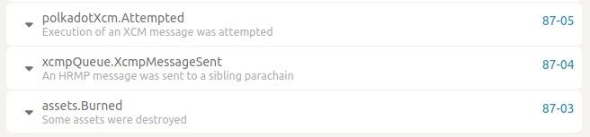
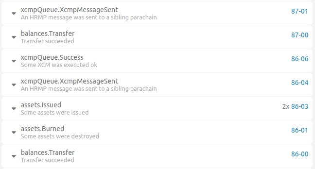
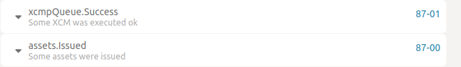
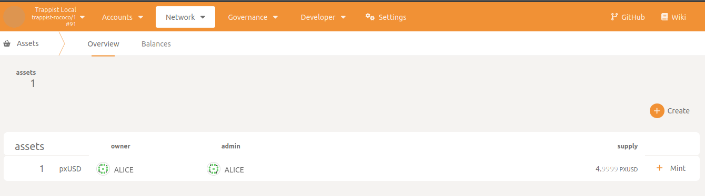

Ejemplos de extrinsic personalizado
=======

Este es un tutorial para utilizar el método de ejecución de la paleta polkadotXcm para reservar la transferencia de activos de trappist a un parachain terciaria que se ejecuta en una red local.

En primer lugar, es necesario configurar una <a href="../local-network/readme-es.md">red local</a>, asegúrese de que ya ha <a href="../local-network/readme-es.md#config-assets">configurado los activos</a>. A continuación, mintear algunos activos a Alice en statamine y <a href="../local-network/readme-es.md#transfer-xusd-from-statemine-to-txusd-on-trappist"> reservar la transferencia de algunos xUSD de statemine a trappist </a>.

Para reservar transferencia de txUSD a pxUSD en parachain terciaria (parachain con id 3000 en nodo local):

comando:
```sh
npx ts-node src/examples/custom-extrinsic/reserve-transfer-from-trappist-parachain-to-tertiary-parachain.ts
```

o manual:
```ts
 const body = {
    message: {
      V2: [
        {
          WithdrawAsset: [
            {
              id: {
                Concrete: {
                  parents: 1,
                  interior: {
                    X3: [
                      {
                        Parachain: 1000,
                      },
                      {
                        PalletInstance: 50,
                      },
                      {
                        GeneralIndex: 1,
                      },
                    ],
                  },
                },
              },
              fun: {
                Fungible: 5_000_000_000_000, // amount to transfer: 5 txUSD
              },
            },
          ],
        },
        {
          InitiateReserveWithdraw: {
            assets: {
              Wild: 'All',
            },
            reserve: {
              parents: 1,
              interior: {
                X1: {
                  Parachain: 1000,
                },
              },
            },
            xcm: [
              {
                BuyExecution: {
                  fees: {
                    id: {
                      Concrete: {
                        parents: 0,
                        interior: {
                          X2: [
                            {
                              PalletInstance: 50,
                            },
                            {
                              GeneralIndex: 1,
                            },
                          ],
                        },
                      },
                    },
                    fun: {
                      Fungible: 1_000_000_000_000,
                    },
                  },
                  weightLimit: 'Unlimited',
                },
              },

              {
                DepositReserveAsset: {
                  assets: {
                    Wild: 'All',
                  },
                  maxAssets: 1,
                  dest: {
                    parents: 1,
                    interior: {
                      X1: {
                        Parachain: 3000,
                      },
                    },
                  },
                  xcm: [
                    {
                      DepositAsset: {
                        assets: {
                          Wild: 'All',
                        },
                        maxAssets: 1,
                        beneficiary: {
                          parents: 0,
                          interior: {
                            X1: {
                              AccountId32: {
                                network: 'Any',
                                id: u8aToHex(decodeAddress('5GrwvaEF5zXb26Fz9rcQpDWS57CtERHpNehXCPcNoHGKutQY')), // alice account address
                              },
                            },
                          },
                        },
                      },
                    },
                  ],
                },
              },
            ],
          },
        },
      ],
    },
    maxWeight: 10_000_000_000,
  }

  const res = await provider.customExtrinsic({
    pallet: 'polkadotXcm',
    method: 'execute',
    body,
  })
```

Este método tarda unos minutos en completarse, va de trappist a statemine y luego a la parachain con id 3000. Deberías ver los eventos en cada parachain en polkadotjs.

eventos en trappist (origen):




eventos en statemine:



eventos en parachain terciaria (destino):



assets transferidos en la parachain 3000 (pxUSD):



Este ejemplo fuera realizado siguiendo <a href="https://youtu.be/UfxU3hUprKo?t=1760">este video</a> y <a href="https://github.com/paritytech/trappist/blob/master/xcm-simulator/src/tests/xcm_use_cases.rs#L224-L358">este ejemplo</a>.
