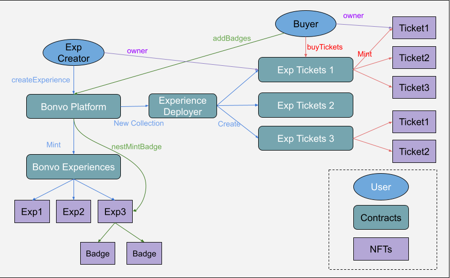

## Experiences Flow

1. The blue flow indicates the creation of a new experience.
    * The Bonvo Platform will mint a new NFT with experience metadata into the Bonvo Experiences Collection. These NFTs will be used to receive Soulbound Reputation Badges by users of the Experience.
    * In parallel, the platform we deploy an entirely new Collection, through the Experience Deployer. This extra level is needed due to size limitations of EVM chains. The new contract will be a collection of NFTs exclusively for that experience, where each NFT will be a ticket for a specific date.
    * This collection, and the expence NFT are both owned by the experience creator.
2. The red flow shows the buying of the ticket. 
    * The platform keeps track of the tickets contract associated with each experience so we can have buyers interact directly with the right one. When the buy N tickets, N NFTs are minted on the collection and owned by the buyer.
    * The next step, not shown in the image is to use and validate tickets. Once the ticket owner arrives to the experience location, they will be asked to use the ticket with some specific one time memo.
    * Once done, the owner of the experience can validate that such ticket was used with the requested memo and allow the ticket holder to join.
    * The ticket cannot be used again but it can be hold indefinitely as proof as attentance.
3. The green flow shows the badge flow.
    * After using the ticket, the holder can drop a reputation badge to the linked experience NFT, which will serve to indicate the quality of the experience, either good or bad.

## Deployed Contracts

All contracts deployed on Moonbase Alpha:
* Plaform: `0x1657CBCe5304B48B397A7FF53c38Ef3535a81070`
* Property: `0xa4F37C5590c78fFBC9F4Ec76664f4EAf32d2E0f6`
* UserReputation: `0xB6A67B45159f923CDf3c9AbC8D5D900DB7e7D0d8`
* Badge: `0x2F08e082FF89E41b9e80aea2658d04F13A348e53`
* Token: `0x7B9B40908ce6B559227B7FC9752B2b2CA5abe48b`
* BonvoExperiencesCollection: `0x97fc05009a9F61cd69F236225e25bD61F96B9098`
* BonvoExperienceDeployerHelper: `0x358C187e26E6BC07d7E96462b61367e0Db15E0D3`

## Deploy Instructions

1. Install packages with `yarn` or `npm i`
2. Test contracts compile: `yarn hardhat compile`
3. Check contract size: `yarn hardhat size-contracts`
4. Run tests: `yarn test`
5. Run prettier: `yarn prettier`
6. Copy .env.example into .env and set your variables
7. Use `contracts/`, `tests/` and `scripts/` to build your code.
8. Deploy on testnet: `yarn hardhat run scripts/deploy.ts --network moonbaseAlpha`
